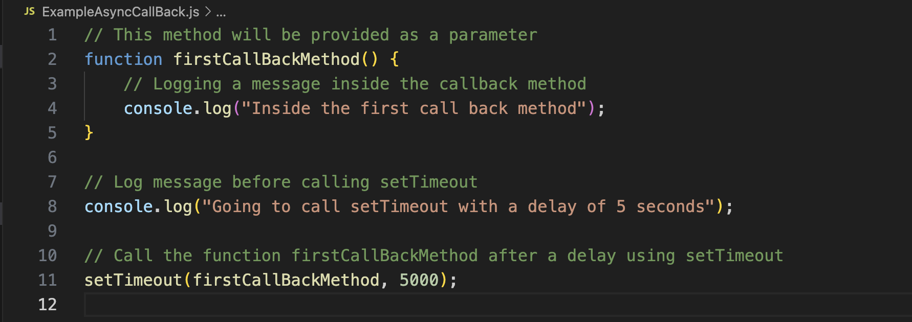

### explanation of the code

firstCallBackMethod() is a function that logs a message "Inside the first call back method". This function will be used as a callback.

Before calling setTimeout, a log message "Going to call setTimeout with a delay of 5 seconds" is printed to indicate the impending timer setup.

setTimeout(firstCallBackMethod, 5000) schedules the execution of firstCallBackMethod() after a delay of 5000 milliseconds (5 seconds), allowing the rest of the code to continue executing immediately while the timer runs in the background.

