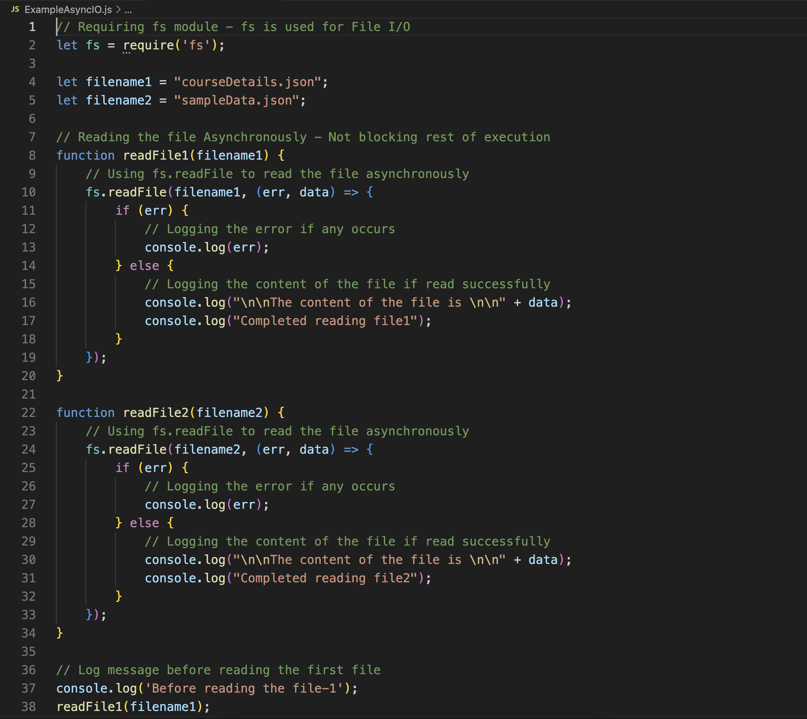

### explanation of the code

 
require('fs') imports the Node.js built-in fs module, which provides file system-related functionality.

readFile1(filename1) and readFile2(filename2) define functions to read courseDetails.json and sampleData.json respectively using fs.readFile, which reads the files asynchronously, allowing the rest of the code to execute without waiting for the file reading to complete.

In each function, fs.readFile(filename, callback) reads the specified file. If an error occurs during reading, it logs the error; otherwise, it logs the content of the file and a completion message.

Before calling readFile1(filename1) and readFile2(filename2) functions, log messages are printed to indicate the start of the reading process for each file.

 
 