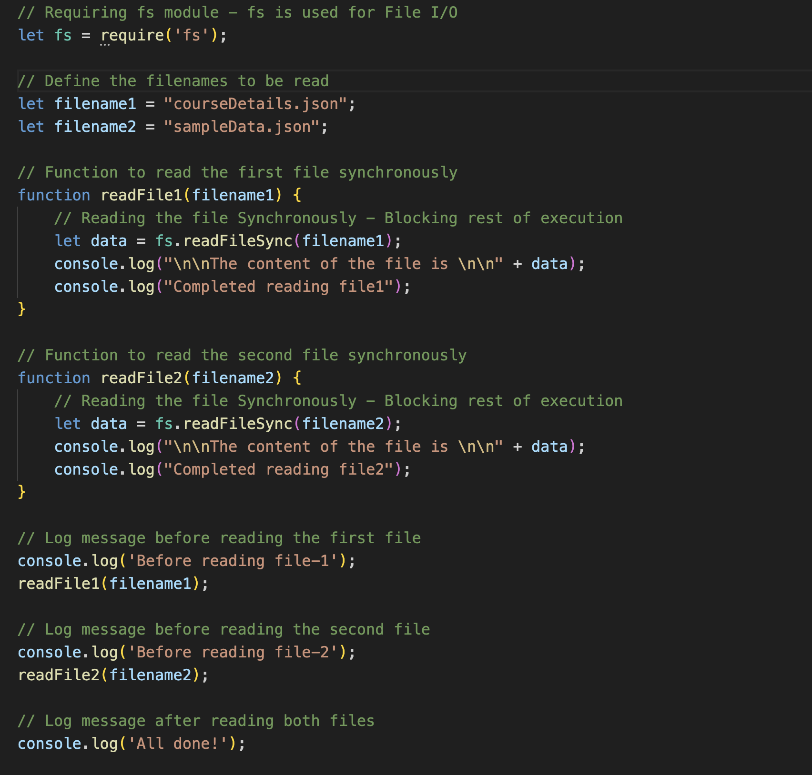

### explanation of the code

require('fs') imports the Node.js built-in fs module, which provides file system-related functionality.

readFile1(filename1) and readFile2(filename2) define functions to read courseDetails.json and sampleData.json respectively synchronously using fs.readFileSync, which blocks further execution until each file is read.

Before calling readFile1(filename1) and readFile2(filename2) functions, log messages are printed to indicate the start of the reading process for each file.

