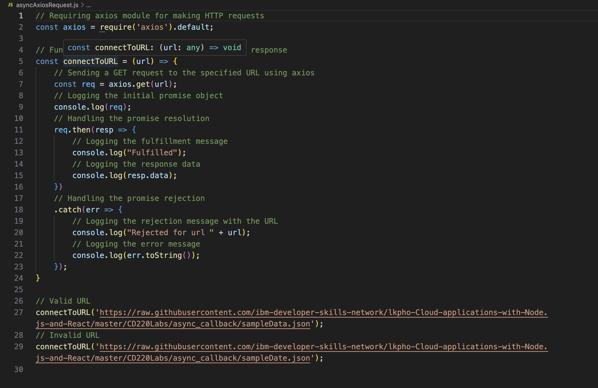

### explanation of the code

#### Explanation of the Code

require('axios').default imports the axios module, which is used for making HTTP requests.

connectToURL(url) defines a function that takes a URL as a parameter and sends a GET request to that URL using axios.get(url). It logs the initial promise object returned by axios.get.

Inside the connectToURL function:

1. req.then(resp => { ... }) handles the promise resolution by logging "Fulfilled" and the response data (resp.data) if the request is successful.
2.  req.catch(err => { ... }) handles the promise rejection by logging "Rejected for url" followed by the URL and the error message if the request fails.

The connectToURL() function is used to call a URL. Providing a valid URL should successfully fetch the data, while an invalid URL should result in an error and activate the rejection handler.

