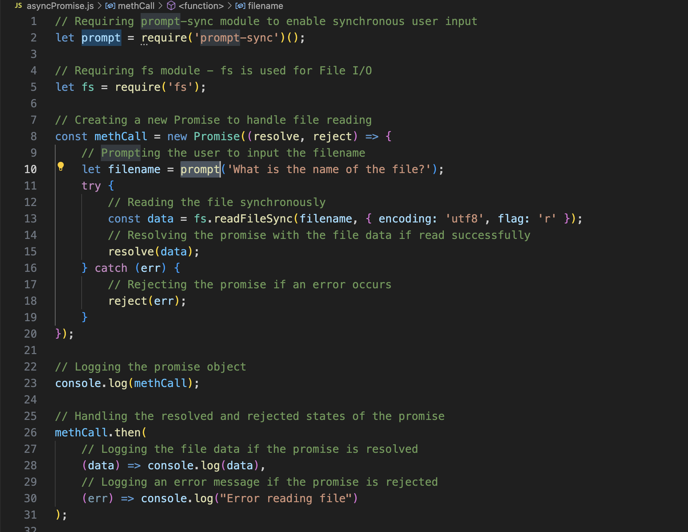

### explanation of the code

require('prompt-sync')() imports the prompt-sync module to enable synchronous user input. require('fs') imports the Node.js built-in fs module for file system-related functionality.

const methCall = new Promise((resolve, reject) => { ... }) creates a new promise to handle the file reading process. The promise takes a callback function with resolve and reject parameters.

Inside the promise:

let filename = prompt('What is the name of the file?') prompts the user to input the filename.
fs.readFileSync(filename, { encoding: 'utf8', flag: 'r' }) attempts to read the specified file synchronously with UTF-8 encoding.
If the file is read successfully, resolve(data) is called with the file data, resolving the promise.
If an error occurs, reject(err) is called with the error, rejecting the promise.
console.log(methCall) logs the promise object.

methCall.then(...).catch(...) handles the promise:

then((data) => console.log(data)) logs the file data if the promise is resolved.
catch((err) => console.log("Error reading file")) logs an error message if the promise is rejected.

