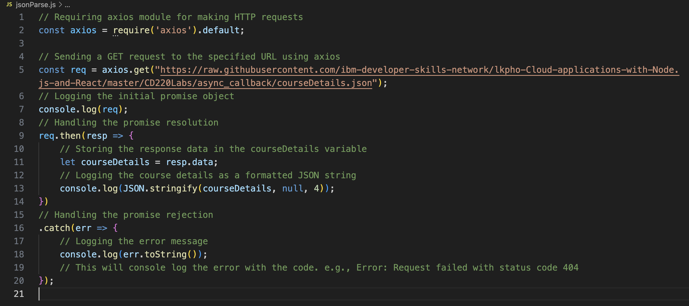

#### Explanation of the Code

require('axios').default imports the axios module, which is used for making HTTP requests.

axios.get() sends a GET request to the specified URL to fetch the courseDetails.json file.

The req constant stores the promise returned by axios.get.

console.log(req) logs the initial promise object to the console.

req.then(resp => { ... }) handles the promise resolution:

1.  let courseDetails = resp.data stores the response data in the courseDetails variable.
console.log(JSON.stringify(courseDetails, null, 4)) logs the course details as a formatted JSON string with indentation.
2.  req.catch(err => { ... }) handles the promise rejection:

console.log(err.toString()) logs the error message, which includes the error code and description if the request fails (e.g., Error: Request failed with status code 404).

